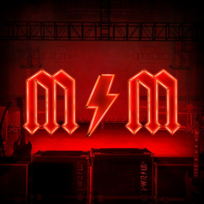

# **ConvM**



# Convert many stuff

Just a little software to help **Apple IIGS** cross dev

#help usage :

```bash
convm.exe v1.2.0.7, (c) R. Malaval & F. Mure 2022.

Usage: convm <convmspec> <option> "<filespec>" "<output folder>"

  <convmspec> is one of the following:
   -crlf        - convert CR to LF
   -lfcr        - convert LF to CR
   -dblf        - replace 2 first $0A (LF) by one in a serie
   -dbcr        - replace 2 first $0D (CR) by one in a serie
   -detab <col> - convert tabs to spaces (tab stop every COL columns)
   -dump        - dump content of a supported file format
   -rlec        - not implemented
   -rled        - decompress with rle algorithms file
   -2bmp        - convert .scr, .shr, .pnt, .pic to .bmp
   -2pic        - convert .bmp to .pic

  <option> is one of the following:
   +lower       - the output file name is in lower case

  <filespec> file extension could be:
   -crlf to -detab : any type of text
   -dump           : any
   -rlec -rled     : .scr, .shr, .pnt, .pic
```

# Special thank's to :

co worker - Frédéric Mure

[Apple2Infinitum](https://app.slack.com/) - digarok

[Brutal Deluxe](https://www.brutaldeluxe.fr/) - Antoine VIGNAU & Olivier ZARDINI

[The Byte Works](https://www.byteworks.us/Products.html) - Mike Westerfield

[GoldenGate](https://goldengate.gitlab.io/) - Kelvin W Sherlock


Have Fun :exclamation:
